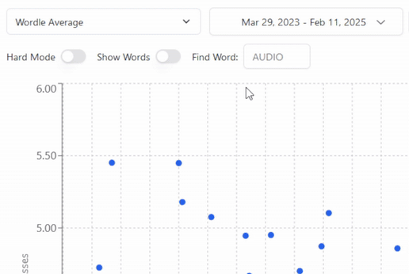

# Wordle Charts

[Visit the site](https://www.wordlecharts.crtez.dev)

An interactive visualization tool for exploring Wordle statistics. Track global averages, compare normal vs. hard mode performance, and analyze your personal Wordle journey through various charts and metrics.

Try typing `cat`:

*Note: the chart is always one day behind, to prevent spoilers.

## Features

- 📊 Multiple chart views including rolling averages and personal performance
- 🎯 Compare your results against global averages
- 🔄 Normal vs. Hard mode comparisons
- 📅 Date range filtering
- 🌓 Dark/Light mode support
  
Built with React, TypeScript, Recharts, Python, and Claude.

*(Unless you live in UTC-12)
